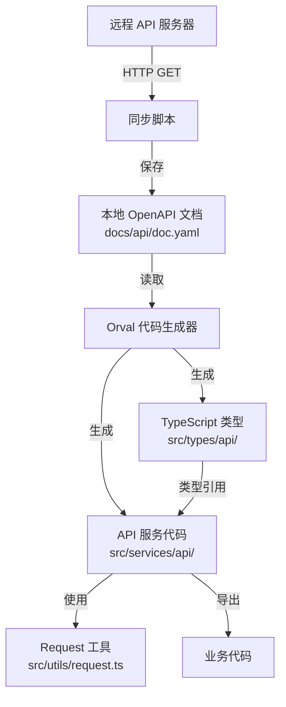

# 设计文档

## 概述

本设计文档描述了如何在项目中集成 Orval 工具，实现从 OpenAPI/Swagger 文档自动生成 TypeScript 类型定义和 API 客户端代码的完整方案。该方案包括三个核心部分：

1. **文档同步机制**：自动从远程服务器下载 OpenAPI 文档到本地
2. **代码生成配置**：配置 Orval 生成符合项目规范的 TypeScript 代码
3. **工作流集成**：通过 npm scripts 将代码生成流程集成到开发工作流中

## 架构设计

### 整体架构图



### 目录结构

```
project-root/
├── docs/
│   └── api/
│       └── doc.yaml                 # 同步的 OpenAPI 文档
├── scripts/
│   └── sync-api-doc.js             # API 文档同步脚本
├── src/
│   ├── types/
│   │   └── api/                    # 生成的类型定义
│   │       ├── user.ts             # 用户相关类型
│   │       ├── product.ts          # 产品相关类型
│   │       └── index.ts            # 类型统一导出
│   ├── services/
│   │   └── api/                    # 生成的 API 服务
│   │       ├── user.ts             # 用户相关接口
│   │       ├── product.ts          # 产品相关接口
│   │       └── index.ts            # 服务统一导出
│   └── utils/
│       └── request.ts              # 现有的请求工具
├── orval.config.ts                 # Orval 配置文件
└── package.json                    # 添加相关脚本命令
```

## 组件和接口设计

### 1. 文档同步脚本 (sync-api-doc.js)

#### 功能描述

负责从远程服务器下载 OpenAPI 文档并保存到本地指定目录。

#### 技术实现

- 使用 Node.js 内置的 `https` 或 `http` 模块
- 使用 `fs` 模块进行文件操作
- 使用 `path` 模块处理路径

#### 接口设计

```javascript
/**
 * 同步 API 文档的主函数
 * @returns {Promise<void>}
 */
async function syncApiDoc() {
  // 实现逻辑
}

/**
 * 下载文件
 * @param {string} url - 文件 URL
 * @returns {Promise<string>} 文件内容
 */
async function downloadFile(url) {
  // 实现逻辑
}

/**
 * 保存文件到本地
 * @param {string} content - 文件内容
 * @param {string} filePath - 保存路径
 * @returns {Promise<void>}
 */
async function saveFile(content, filePath) {
  // 实现逻辑
}
```

#### 错误处理

- 网络请求失败：输出错误信息并返回退出码 1
- 文件写入失败：输出错误信息并返回退出码 1
- 目录不存在：自动创建目录

#### 输出示例

```bash
# 成功
✓ API 文档同步成功: docs/api/doc.yaml

# 失败
✗ 下载 API 文档失败: ECONNREFUSED
```

### 2. Orval 配置文件 (orval.config.ts)

#### 功能描述

配置 Orval 的代码生成行为，包括输入源、输出目录、生成选项等。

#### 配置结构

```typescript
import { defineConfig } from 'orval';

export default defineConfig({
  api: {
    input: {
      target: './docs/api/doc.yaml',
    },
    output: {
      // 输出配置
    },
  },
});
```

#### 关键配置项

| 配置项 | 说明 | 值 |
|--------|------|-----|
| `input.target` | OpenAPI 文档路径 | `./docs/api/doc.yaml` |
| `output.target` | 生成代码输出目录 | `src/services/api` |
| `output.schemas` | 类型定义输出目录 | `src/types/api` |
| `output.client` | HTTP 客户端类型 | `axios` |
| `output.mode` | 生成模式 | `tags-split` |
| `output.override.mutator` | 自定义请求函数 | `src/utils/request.ts` |

### 3. 类型生成器配置

#### 生成策略

- **按标签分组**：根据 OpenAPI 文档中的 tags 将类型分组到不同文件
- **文件命名**：使用 kebab-case（小写加连字符）格式
- **类型导出**：使用命名导出，避免默认导出

#### 生成的类型结构

```typescript
// src/types/api/user.ts

/**
 * 用户信息
 */
export interface User {
  id: string;
  name: string;
  email: string;
  createdAt: string;
}

/**
 * 获取用户列表请求参数
 */
export interface GetUsersParams {
  page: number;
  pageSize: number;
  keyword?: string;
}

/**
 * 获取用户列表响应
 */
export interface GetUsersResponse {
  code: number;
  message: string;
  result: {
    list: User[];
    total: number;
  };
}
```

### 4. API 服务生成器配置

#### 生成策略

- **按标签分组**：根据 OpenAPI 文档中的 tags 将接口分组到不同文件
- **文件命名**：使用 kebab-case 格式
- **函数命名**：使用 camelCase 格式
- **请求工具**：使用项目现有的 `src/utils/request.ts`

#### 生成的服务代码结构

```typescript
// src/services/api/user.ts

import request from '@/utils/request';
import type { GetUsersParams, GetUsersResponse, User } from '@/types/api/user';

/**
 * 获取用户列表
 * @param params 查询参数
 * @returns 用户列表
 */
export const getUsers = (params: GetUsersParams): Promise<GetUsersResponse> => {
  return request('/api/users', {
    method: 'GET',
    params,
  });
};

/**
 * 获取用户详情
 * @param userId 用户 ID
 * @returns 用户信息
 */
export const getUserById = (userId: string): Promise<User> => {
  return request(`/api/users/${userId}`, {
    method: 'GET',
  });
};
```

### 5. 自定义请求函数适配器

#### 功能描述

创建一个适配器函数，将 Orval 生成的请求调用适配到项目现有的 `request` 工具。

#### 实现方案

```typescript
// src/utils/orval-mutator.ts

import request from '@/utils/request';
import type { AxiosRequestConfig } from 'axios';

/**
 * Orval 自定义请求函数
 * 将 Orval 生成的请求适配到项目的 request 工具
 */
export const orvalMutator = async <T>(config: AxiosRequestConfig): Promise<T> => {
  const { url, ...restConfig } = config;
  return request<T>(url!, restConfig);
};
```

## 数据模型

### OpenAPI 文档结构

```yaml
openapi: 3.0.0
info:
  title: API 文档
  version: 1.0.0
servers:
  - url: http://localhost:8080
tags:
  - name: user
    description: 用户相关接口
  - name: product
    description: 产品相关接口
paths:
  /api/users:
    get:
      tags:
        - user
      summary: 获取用户列表
      parameters:
        - name: page
          in: query
          schema:
            type: integer
      responses:
        '200':
          description: 成功
          content:
            application/json:
              schema:
                $ref: '#/components/schemas/UserListResponse'
components:
  schemas:
    User:
      type: object
      properties:
        id:
          type: string
        name:
          type: string
```

### 响应数据统一格式

根据现有的 `src/utils/request.ts`，后端响应格式为：

```typescript
interface ResponseData<T = any> {
  code: number;      // 业务状态码，0 表示成功
  message: string;   // 响应消息
  result: T;         // 实际数据
}
```

Orval 生成的类型需要匹配这个格式。

## 错误处理

### 1. 文档同步错误

| 错误类型 | 处理方式 |
|---------|---------|
| 网络连接失败 | 输出错误信息，退出码 1 |
| 404 Not Found | 提示文档地址不存在 |
| 超时 | 提示请求超时，建议检查网络 |
| 文件写入失败 | 提示权限或磁盘空间问题 |

### 2. 代码生成错误

| 错误类型 | 处理方式 |
|---------|---------|
| OpenAPI 文档格式错误 | Orval 输出详细错误信息 |
| 类型冲突 | 检查 OpenAPI 文档中的类型定义 |
| 路径别名解析失败 | 检查 tsconfig.json 配置 |

### 3. 运行时错误

生成的 API 服务代码会使用项目现有的错误处理机制（`src/utils/request.ts` 中的 `errorHandler`）：

- 网络错误：显示"网络连接失败"提示
- 401/403 错误：显示"登录已过期"提示
- 其他 API 错误：显示服务器返回的错误消息

## 测试策略

### 1. 文档同步脚本测试

**测试场景**：

- ✓ 成功下载并保存文档
- ✓ 网络请求失败时正确处理
- ✓ 目录不存在时自动创建
- ✓ 文件写入失败时正确处理

**测试方法**：

- 使用 Vitest 编写单元测试
- Mock HTTP 请求和文件系统操作

### 2. 代码生成测试

**测试场景**：

- ✓ 生成的类型符合 TypeScript 严格模式
- ✓ 生成的代码通过 ESLint 检查
- ✓ 生成的代码通过 Prettier 格式化
- ✓ 路径别名正确解析

**测试方法**：

- 运行 `yarn typecheck` 检查类型
- 运行 `yarn lint` 检查代码规范
- 手动检查生成的代码结构

### 3. API 服务集成测试

**测试场景**：

- ✓ 生成的 API 函数可以正常调用
- ✓ 请求参数类型正确
- ✓ 响应数据类型正确
- ✓ 错误处理正常工作

**测试方法**：

- 使用 MSW (Mock Service Worker) 模拟 API 响应
- 编写集成测试验证 API 调用

## 工作流集成

### NPM Scripts 设计

```json
{
  "scripts": {
    "api:sync": "node scripts/sync-api-doc.js",
    "api:generate": "orval --config orval.config.ts",
    "api:sync-and-generate": "yarn api:sync && yarn api:generate"
  }
}
```

### 开发工作流


### 推荐使用场景

1. **初次集成**：运行 `yarn api:sync-and-generate` 生成所有代码
2. **日常开发**：后端 API 更新后运行 `yarn api:sync-and-generate`
3. **仅更新代码**：文档已存在时运行 `yarn api:generate`
4. **CI/CD 集成**：在构建流程中添加代码生成步骤

## 代码规范集成

### 1. Prettier 集成

Orval 配置中启用 Prettier 格式化：

```typescript
output: {
  prettier: true,  // 使用项目的 Prettier 配置
}
```

### 2. ESLint 集成

生成的代码需要符合项目的 ESLint 规则：

- 使用命名导出
- 使用路径别名 `@/`
- 符合 Airbnb TypeScript 规范

### 3. TypeScript 严格模式

生成的代码需要通过 TypeScript 严格模式检查：

- 所有类型必须明确定义
- 不允许 `any` 类型（除非必要）
- 函数参数和返回值必须有类型注解

## 性能考虑

### 1. 代码生成性能

- **按标签分组**：避免生成单个巨大文件，提高编译速度
- **增量生成**：Orval 只在文档变化时重新生成代码
- **并行处理**：Orval 内部使用并行处理提高生成速度

### 2. 运行时性能

- **Tree Shaking**：使用命名导出支持 Tree Shaking
- **代码分割**：按标签分组的文件支持按需加载
- **类型优化**：生成的类型定义不影响运行时性能

## 安全考虑

### 1. 文档同步安全

- **HTTPS 支持**：支持从 HTTPS 服务器下载文档
- **超时设置**：避免长时间等待
- **错误处理**：不暴露敏感信息

### 2. 代码生成安全

- **输入验证**：Orval 验证 OpenAPI 文档格式
- **路径安全**：防止路径遍历攻击
- **依赖安全**：使用官方维护的 Orval 包

## 维护和扩展

### 1. 版本管理

- OpenAPI 文档版本化：将 `docs/api/doc.yaml` 纳入版本控制
- 生成代码版本化：将生成的代码提交到 Git
- 配置文件版本化：`orval.config.ts` 纳入版本控制

### 2. 扩展性

- **多个 API 源**：可以配置多个 Orval 配置生成不同 API 的代码
- **自定义模板**：可以自定义 Orval 生成代码的模板
- **插件支持**：可以编写 Orval 插件扩展功能

### 3. 文档和培训

- 在项目 README 中添加使用说明
- 编写开发者指南说明如何使用生成的 API
- 提供示例代码展示最佳实践

## 技术决策

### 为什么选择 Orval？

1. **TypeScript 优先**：专为 TypeScript 设计，生成类型安全的代码
2. **灵活配置**：支持自定义请求函数、模板等
3. **活跃维护**：社区活跃，持续更新
4. **与现有工具集成**：支持 Axios、React Query 等常用工具

### 为什么按标签分组？

1. **模块化**：每个业务模块独立，便于维护
2. **性能优化**：支持按需加载和 Tree Shaking
3. **团队协作**：不同团队成员可以独立维护不同模块
4. **可读性**：文件结构清晰，易于查找

### 为什么使用现有的 request 工具？

1. **统一错误处理**：复用项目现有的错误处理逻辑
2. **统一拦截器**：复用认证、日志等拦截器
3. **减少重复代码**：避免重复实现相同功能
4. **保持一致性**：与项目其他代码保持一致的请求方式

## 总结

本设计方案通过集成 Orval 工具，实现了从 OpenAPI 文档自动生成 TypeScript 类型和 API 客户端代码的完整流程。方案的核心优势包括：

1. **自动化**：减少手动编写重复代码的工作量
2. **类型安全**：生成的代码提供完整的类型支持
3. **规范统一**：生成的代码符合项目代码规范
4. **易于维护**：文档和代码保持同步，降低维护成本
5. **灵活扩展**：支持自定义配置和扩展

该方案已充分考虑了项目现有的技术栈（Vite + React + TypeScript）和代码规范，确保生成的代码能够无缝集成到现有项目中。
